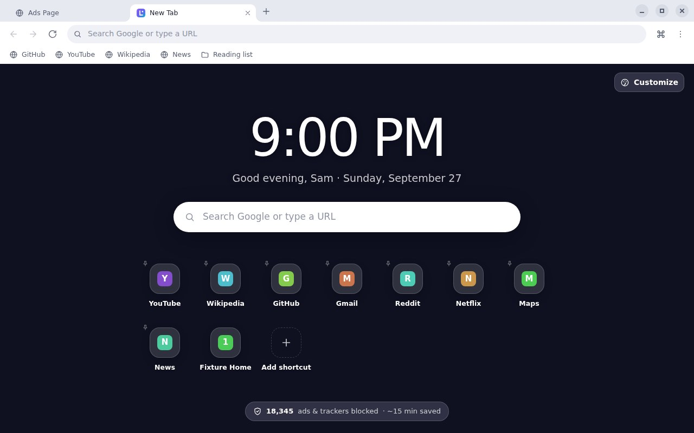
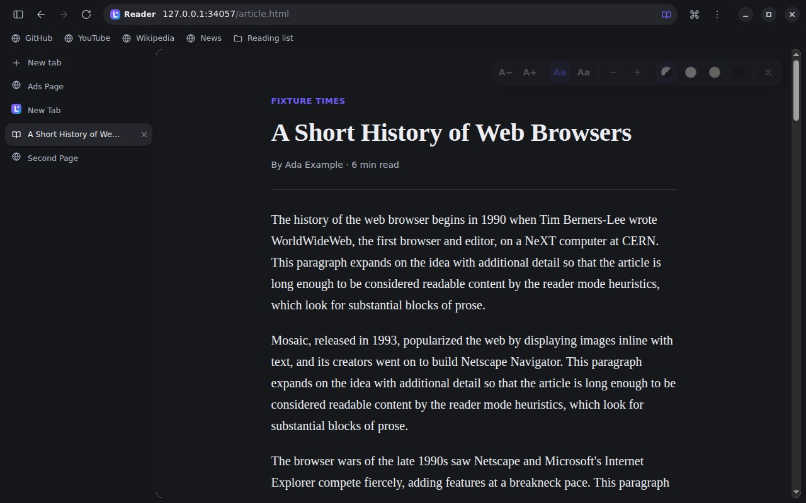
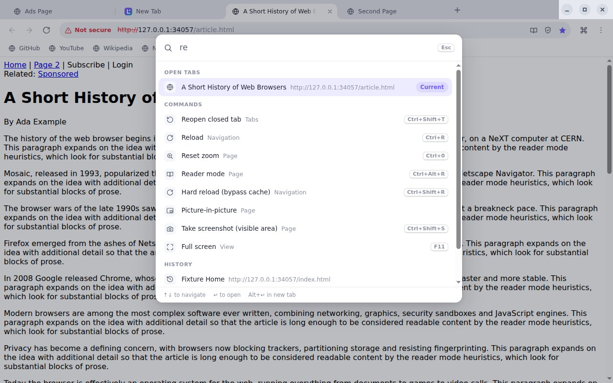
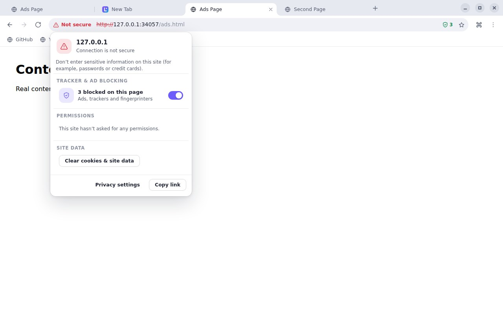
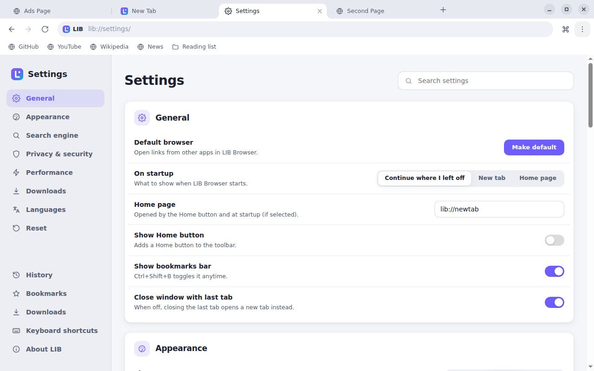
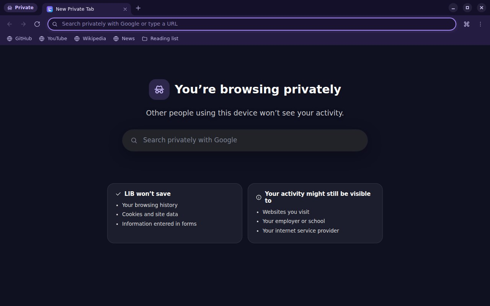

<p align="center">
  
</p>

<h1 align="center">LIB Browser</h1>

<p align="center"><b>Fast. Private. Beautiful.</b><br>
A modern desktop web browser for Windows, macOS and Linux — built on Chromium, with ad &amp; tracker blocking, split view, a command palette and reader mode out of the box.</p>

<p align="center">
  
</p>

---

## Download & install

Installers are built automatically by GitHub Actions for every platform:

| Platform | File | Notes |
| --- | --- | --- |
| **Windows** 10/11 | `LIB-Browser-Setup-<version>-x64.exe` (or `-arm64`) | Standard installer. A portable `.exe` is also provided. |
| **macOS** 11+ | `LIB-Browser-<version>-arm64.dmg` (Apple Silicon) or `-x64.dmg` (Intel) | The app isn't notarized yet: the first time, right-click the app → **Open**. |
| **Linux** | `LIB-Browser-<version>-x86_64.AppImage` or `.deb` | AppImage: `chmod +x` then run. Debian/Ubuntu: `sudo apt install ./LIB-Browser-*.deb` |

**Where to get them**

- **Releases** — push a version tag (for example `v1.0.0`) and the *Build installers* workflow publishes a GitHub Release with all installers attached.
- **Any time** — open the repository's **Actions** tab → **Build installers** → **Run workflow**. When it finishes, download the installers from the run's **Artifacts** section.

After installing, open **Settings → General → Make default** to use LIB for links from other apps.

## Features

**Browsing**
- Tabs you can drag to reorder, pin, mute, duplicate, and tear off into a new window. Middle-click to close. Recently closed tabs and windows come back with <kbd>Ctrl</kbd>+<kbd>Shift</kbd>+<kbd>T</kbd>, including their back/forward history.
- **Vertical tabs**: a sidebar for people who keep dozens of tabs open.
- **Split view**: two tabs side by side, with a draggable divider.
- **Command palette** (<kbd>Ctrl</kbd>+<kbd>Shift</kbd>+<kbd>A</kbd>): fuzzy-search open tabs, bookmarks, history, recently closed tabs and every browser action.
- **Smart address bar**:
  - Inline autocomplete from your history, search suggestions, and "switch to tab".
  - A built-in calculator (type `15% of 80`).
  - Site shortcuts: `yt lofi`, `wiki Ada Lovelace`, `gh electron`, or any `!bang`, e.g. `!w`, `!a`, `!r`.
- **Reader mode** (Mozilla Readability): clutter-free articles with font, size, width and sepia/dark controls.
- **Find in page**, per-site **zoom** that's remembered, **picture-in-picture**, **screenshots** (visible area or full page), page **translation**, **print** and **save page**.
- **Session restore**: pick up where you left off, even after a crash. Background tabs load lazily.
- Friendly **error pages**, a **crashed-tab** recovery screen, and **docked DevTools** (<kbd>F12</kbd>).

**Privacy & security**
- Built-in **ad & tracker blocking** using the Ghostery engine with EasyList, EasyPrivacy and uBlock Origin lists:
  - It blocks network requests and hides leftover ad slots.
  - It shows a per-page blocked count, lets you allow ads on individual sites, and updates its lists automatically.
- **Private windows** use an in-memory profile that's wiped when the last one closes.
- **HTTPS-Only mode**, Do Not Track, Global Privacy Control, and optional third-party cookie blocking.
- **Permission prompts** for camera, microphone, location, notifications, screen sharing and more. Your choices are remembered per site and editable in the padlock panel.
- A clean Chrome user agent (sites don't see "Electron"). Each tab runs sandboxed with context isolation, and internal pages are locked down with a strict CSP.

**Your stuff**
- **Bookmarks** with folders, a bookmarks bar, and a full manager. Import/export works with Chrome, Edge, Firefox and Safari (HTML format).
- **History** grouped by day, with search and bulk delete. **Clear browsing data** by time range.
- **Downloads** with pause/resume, progress in the toolbar and taskbar, and a downloads page.
- A **New Tab page** with a clock, greeting, search, shortcuts and privacy stats. Choose from backgrounds like Aurora, Sunset and Ocean, or upload your own photo.
- **Themes**: light, dark or automatic, eight accent colors plus a custom picker, and compact mode.
- **Tab sleeping** frees memory from tabs you haven't used in a while, and a **task manager** (<kbd>Shift</kbd>+<kbd>Esc</kbd>) shows per-tab memory and CPU.

<p align="center">
  
</p>

<table>
  <tr>
    <td></td>
    <td></td>
  </tr>
  <tr>
    <td></td>
    <td></td>
  </tr>
</table>

## Keyboard shortcuts

On macOS, use <kbd>⌘</kbd> instead of <kbd>Ctrl</kbd>. The full list is in the app under **Menu → Keyboard shortcuts**.

| Action | Shortcut |
| --- | --- |
| New tab / window / private window | <kbd>Ctrl</kbd>+<kbd>T</kbd> / <kbd>Ctrl</kbd>+<kbd>N</kbd> / <kbd>Ctrl</kbd>+<kbd>Shift</kbd>+<kbd>N</kbd> |
| Close tab / reopen closed tab | <kbd>Ctrl</kbd>+<kbd>W</kbd> / <kbd>Ctrl</kbd>+<kbd>Shift</kbd>+<kbd>T</kbd> |
| Next / previous tab, jump to tab 1–8, last tab | <kbd>Ctrl</kbd>+<kbd>Tab</kbd> / <kbd>Ctrl</kbd>+<kbd>Shift</kbd>+<kbd>Tab</kbd>, <kbd>Ctrl</kbd>+<kbd>1</kbd>…<kbd>8</kbd>, <kbd>Ctrl</kbd>+<kbd>9</kbd> |
| Address bar / search the web | <kbd>Ctrl</kbd>+<kbd>L</kbd> / <kbd>Ctrl</kbd>+<kbd>K</kbd> |
| Search tabs & commands | <kbd>Ctrl</kbd>+<kbd>Shift</kbd>+<kbd>A</kbd> |
| Find in page | <kbd>Ctrl</kbd>+<kbd>F</kbd>, then <kbd>Enter</kbd> / <kbd>Shift</kbd>+<kbd>Enter</kbd> |
| Bookmark page / bookmarks bar / manager | <kbd>Ctrl</kbd>+<kbd>D</kbd> / <kbd>Ctrl</kbd>+<kbd>Shift</kbd>+<kbd>B</kbd> / <kbd>Ctrl</kbd>+<kbd>Shift</kbd>+<kbd>O</kbd> |
| History / downloads / settings | <kbd>Ctrl</kbd>+<kbd>H</kbd> / <kbd>Ctrl</kbd>+<kbd>J</kbd> / <kbd>Ctrl</kbd>+<kbd>,</kbd> |
| Reader mode / screenshot | <kbd>Ctrl</kbd>+<kbd>Alt</kbd>+<kbd>R</kbd> / <kbd>Ctrl</kbd>+<kbd>Shift</kbd>+<kbd>S</kbd> |
| Zoom in / out / reset | <kbd>Ctrl</kbd>+<kbd>+</kbd> / <kbd>Ctrl</kbd>+<kbd>-</kbd> / <kbd>Ctrl</kbd>+<kbd>0</kbd> |
| Developer tools / full screen | <kbd>F12</kbd> / <kbd>F11</kbd> |

Web apps get the first chance at shortcuts like <kbd>Ctrl</kbd>+<kbd>F</kbd>, <kbd>Ctrl</kbd>+<kbd>S</kbd> and <kbd>Ctrl</kbd>+<kbd>U</kbd>, so Google Docs and web editors keep working. The browser handles them only when the page doesn't.

## Build from source

Requirements: [Node.js](https://nodejs.org) 22 or newer.

```bash
git clone https://github.com/tolbertinnovation-debug/Lib-Web-browser.git
cd Lib-Web-browser
npm install
npm start            # run the browser
```

| Command | What it does |
| --- | --- |
| `npm start` | Run LIB Browser from source |
| `npm test` | Unit tests (address bar logic, calculator, history, bookmarks, settings) |
| `npm run test:e2e` | End-to-end tests that drive the real browser (Linux needs a display, e.g. `xvfb-run -a npm run test:e2e`) |
| `npm run dist` | Build installers for the current OS into `dist/` |
| `npm run build:adblock` | Pre-build the bundled ad-block engine (`resources/adblock-engine.bin`) |
| `npm run build:icons` | Re-render app icons from `build/icon.svg` |

Set `LIB_DEVTOOLS=1` to open DevTools for the browser's own UI.

## How it's built

LIB Browser is an [Electron](https://www.electronjs.org) app. Each browser window is a frameless `BaseWindow` that contains:

- **The UI view** (`src/renderer`): the tab strip, toolbar, address bar and bookmarks bar, written in dependency-free JavaScript and CSS. It covers the whole window, with a transparent content area.
- **Tab views**: one sandboxed `WebContentsView` per visible tab (two in split view), placed over the content area.
- A small **status bubble** view and optional **docked DevTools**.

When a popup opens (address-bar suggestions, menus, dialogs), the UI view is briefly **raised above the page**. Its transparent regions let the page show through, so popups can overlap web content just like in Chrome.

```
src/
  main/        Browser process: windows, tabs, sessions, network pipeline (ad blocking,
               HTTPS-Only, DNT/GPC), downloads, permissions, history, bookmarks,
               settings, session restore, commands & shortcuts, menus, IPC
  preload/     Sandboxed bridges for the UI and for internal pages
  renderer/    The browser UI (tabs, omnibox, popups, command palette, find bar…)
  pages/       Internal lib:// pages: newtab, settings, history, bookmarks,
               downloads, reader, about, welcome, shortcuts, tasks
tests/         Unit tests and Playwright-driven end-to-end tests
build/         Icons and installer scripts
.github/       CI (tests) and release (installers) workflows
```

Security model:
- Web pages run sandboxed with context isolation and never see privileged APIs.
- Internal `lib://` pages get a small API. The main process re-checks that every call comes from a top-level `lib://` document.
- Web pages can't navigate to `lib://` pages or embed them.
- Keyboard-shortcut messages from pages are only honored right after a matching real key press.

## Privacy

LIB has no accounts, no telemetry and no crash uploads. Your history, bookmarks and settings stay in your profile folder (shown on the **About** page). The network requests LIB makes on its own are:
- filter-list updates for the ad blocker, every few days;
- search suggestions, without cookies, which you can turn off in Settings.

## License

[MIT](LICENSE). Built on Chromium, Electron, the Ghostery ad-blocking engine (MPL-2.0) and Mozilla Readability (Apache-2.0).
